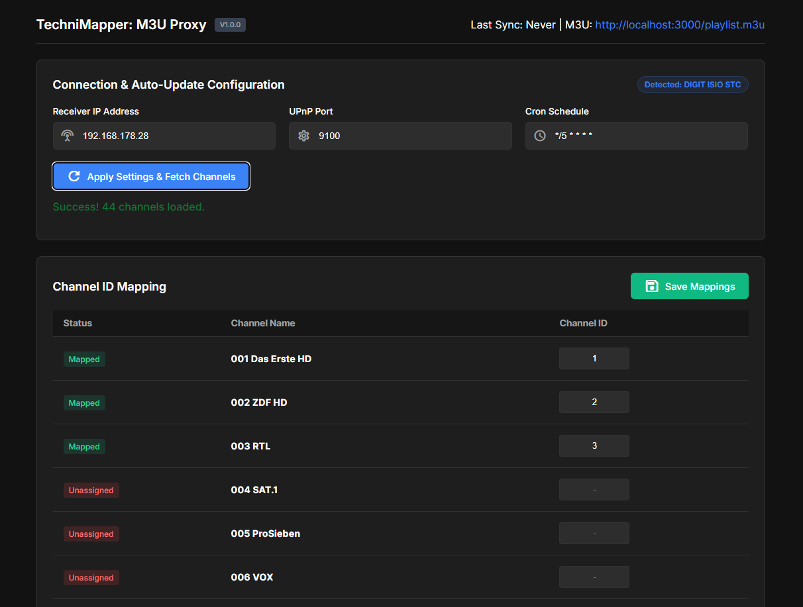
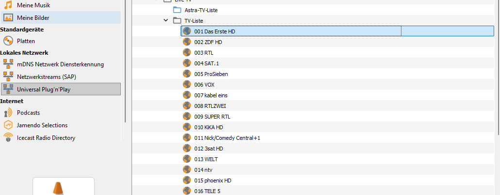
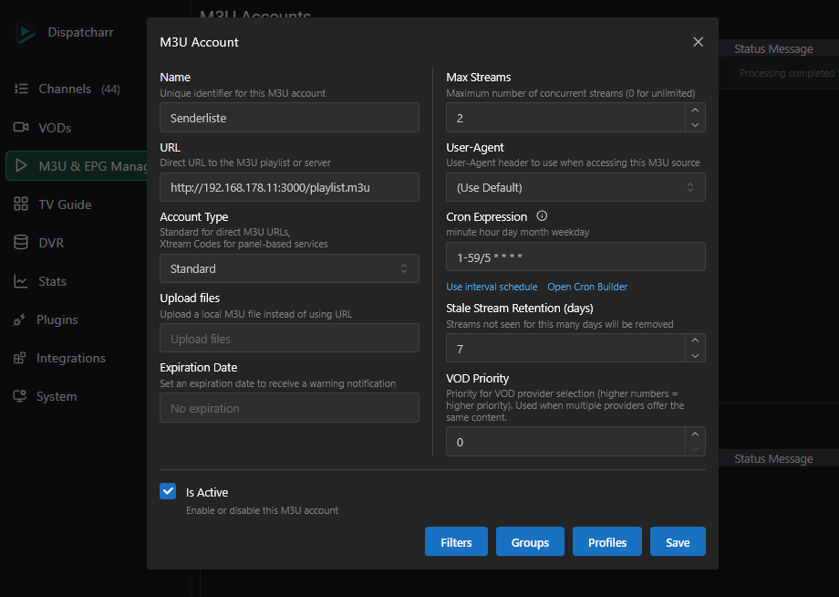
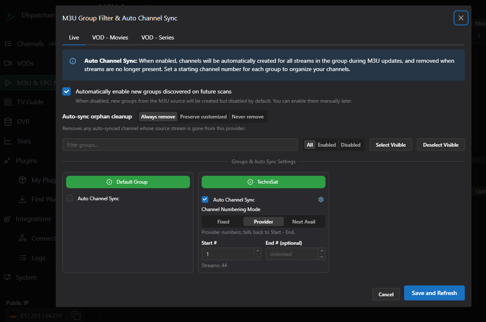
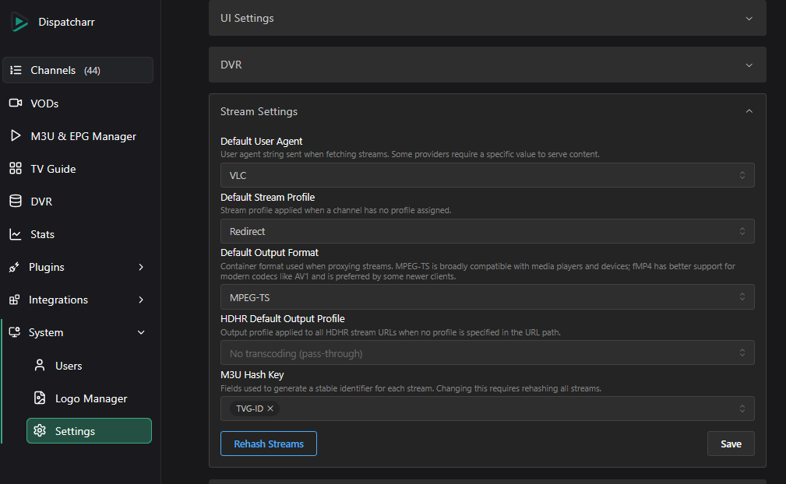

# TechniMapper: M3U Channel Mapper & M3U Proxy
A lightweight abstraction proxy that stabilizes shifting TechniSat UPnP streams into a permanent, static M3U playlist tailored exclusively for Dispatcharr.

## The Problem: Stream Instability
TechniSat receivers frequently change internal stream URLs and session parameters due to channel rescans, background updates, or reboots. Linking these raw URLs directly into IPTV tools like Dispatcharr causes constant breakage, as the streams become dead ends as soon as the receiver refreshes its internal state.

## The Solution: TechniMapper
TechniMapper acts as an abstraction layer to ensure your configuration remains stable:

* Dynamic Synchronization: A background cron engine crawls the receiver’s shifting UPnP structure to fetch the latest, valid stream URLs.

* Static Mapping: Maps volatile URLs to permanent, custom Channel IDs defined via the Web UI.

* Persistent Playlist: Provides a consistent M3U endpoint. Dispatcharr only communicates with TechniMapper, ensuring your setup never breaks when the receiver updates.

## Compatibility Note
TechniMapper is specifically developed and tested for the TechniSat DIGIT ISIO STC.

✅ Supported: DIGIT ISIO STC

❌ Not Supported: DIGIT ISIO S / S1 / S2, DIGIPLUS UHD S2, DIGIT ISIO S3

## Targeted Integration
This tool is **specifically built and optimized to be utilized exclusively in tandem with Dispatcharr**. It serves as the dedicated translation bridge, eliminating formatting mismatches and URL instability natively, feeding your TechniSat tuner streams reliably into your automated **Dispatcharr** pipeline.



## Prerequisites

⚠️ **Crucial Step:** Before running this tool, you **must have a valid, fully configured TV channel list** set up directly on your receiver (specifically tested on the *TechniSat DIGIT ISIO STC*). If no internal channel list exists on the hardware, the UPnP directory tree will remain empty, and the mapper won't be able to discover any streams.



## Docker Deployment

To ensure maximum stability and persistent storage of your mapped channel configurations, deploy the mapper using Docker Compose.

## Quick Start & Deployment

You can deploy this stack instantly. Choose the method that best fits your environment:

### Option A: Portainer Stack / Web UI (Recommended for Easy Setup)
Perfect for headless servers. You do not need to clone anything or touch the command line:

1. Open your **Portainer** dashboard.
2. Navigate to **Stacks** -> **Add stack**.
3. Give it a name (e.g., `technimapper-m3u-proxy`).
4. Select the **Web editor** and paste the following configuration:

```yaml
version: '3.8'

services:
  technimapper-m3u-proxy:
    image: ghcr.io/danielfranze/technimapper-m3u-proxy:latest
    container_name: technimapper-m3u-proxy
    ports:
      - "3000:3000"
    volumes:
      - ./data:/app/data
      - /etc/localtime:/etc/localtime:ro
    environment:
      - TZ=Europe/Berlin
    restart: unless-stopped
```

### Option B: Docker CLI Run (Ultra-Quick Terminal Start)
If you just want to fire up the container instantly via SSH/Terminal without using Compose or Portainer, run this standard command:

```bash
docker pull ghcr.io/danielfranze/technimapper-m3u-proxy:latest
```
```bash
docker run -d \
  -p 3000:3000 \
  --name technimapper-m3u-proxy \
  -v ./data:/app/data \
  -v /etc/localtime:/etc/localtime:ro \
  -e TZ=Europe/Berlin \
  --restart unless-stopped \
  ghcr.io/danielfranze/technimapper-m3u-proxy:latest
  ```


## Dispatcharr Configuration

### 1. M3U Account Settings
Add a new M3U account in Dispatcharr using the playlist URL provided by your Mapper instance.

* URL: http://<YOUR-SERVER-IP>:3000/playlist.m3u

* Account Type: Standard

* Cron Expression: We recommend 1-59/5 * * * * to ensure Dispatcharr checks for updates regularly without overloading the receiver.



#### 1.1 M3U Group & Auto-Sync Settings
To fully automate your channel management, configure the Group settings within your M3U account. This ensures that Dispatcharr automatically adopts any channel changes detected by the Mapper.

* Auto Channel Sync: Enable this for the "TechniSat" group. This allows Dispatcharr to automatically create or remove channels based on the current M3U list.

* Channel Numbering Mode: Set this to Provider. Since the Mapper provides the tvg-chno attribute, Dispatcharr will automatically respect the channel numbering defined on your TechniSat receiver.

* Auto-sync orphan cleanup: We recommend Always remove. This keeps your channel list clean by automatically removing any streams that are no longer present on the receiver (e.g., after a channel rescan).



### 2. Stream Settings
For best compatibility with TechniSat streams, configure your system-wide stream settings as follows:

* Default User Agent: Set to VLC. This often helps with handshake issues on older receiver firmware.

* Default Stream Profile: Use Redirect. This allows the receiver to push the stream directly to your player/client.

* Default Output Format: MPEG-TS is the native format for DVB streams and provides the highest compatibility.

* M3U Hash Key: Set this to TVG-ID. This ensures that Dispatcharr correctly tracks your channels based on the static IDs you defined in the Mapper UI.



### ℹ️ Pro-Tip:
Note: To keep your setup perfectly synchronized and prevent any "dead links," align your cron schedules to ensure the Mapper has updated data before Dispatcharr requests it:

* TechniMapper Cron: Set this to */5 * * * * (every 5 minutes). This ensures the Mapper proactively fetches fresh stream URLs from your receiver and updates the playlist.

* Dispatcharr Cron: Set this to 1-59/5 * * * * (every 5 minutes, starting 1 minute past). This slight offset ensures that Dispatcharr always pulls the "freshly baked" playlist from your Mapper.

By following this 5-minute sync cycle with a 1-minute offset, your Dispatcharr will always have the most current and valid stream URLs available.

## License

This project is open-source software licensed under the [MIT License](LICENSE.md). Feel free to use, modify, and distribute it.
